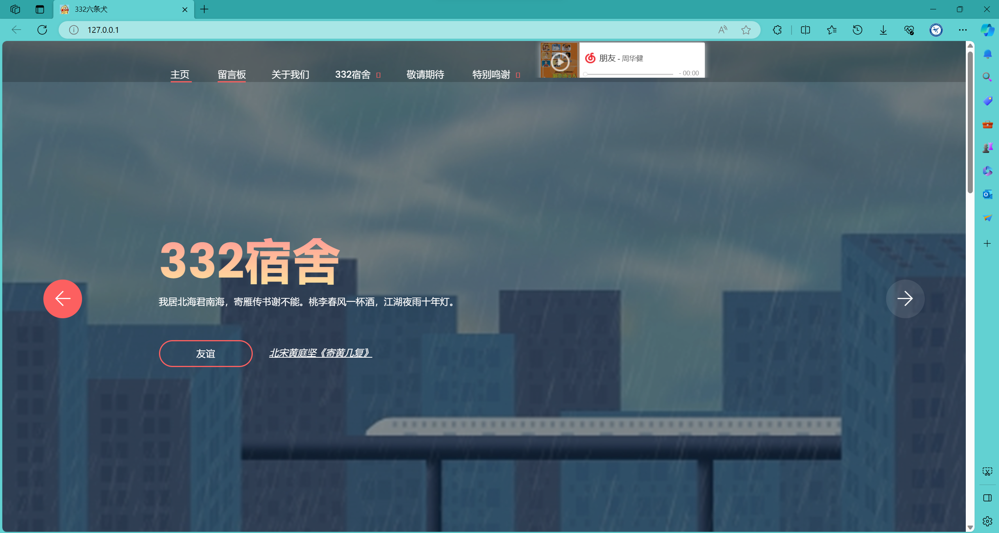
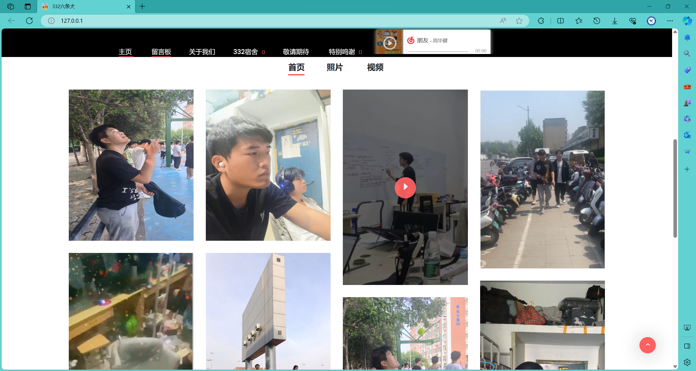
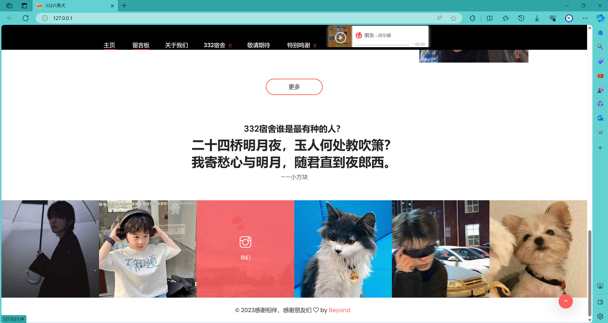
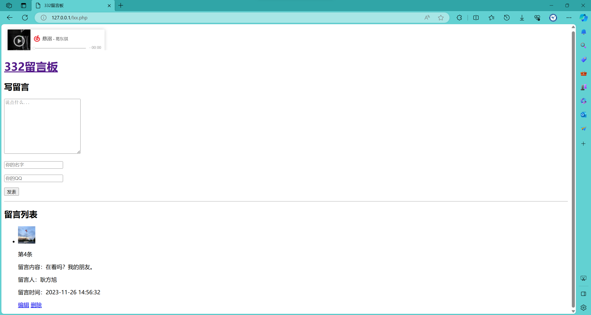
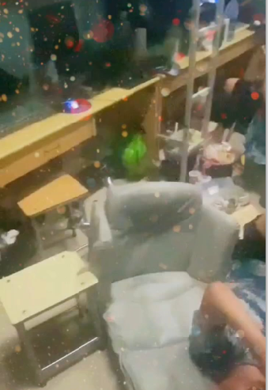
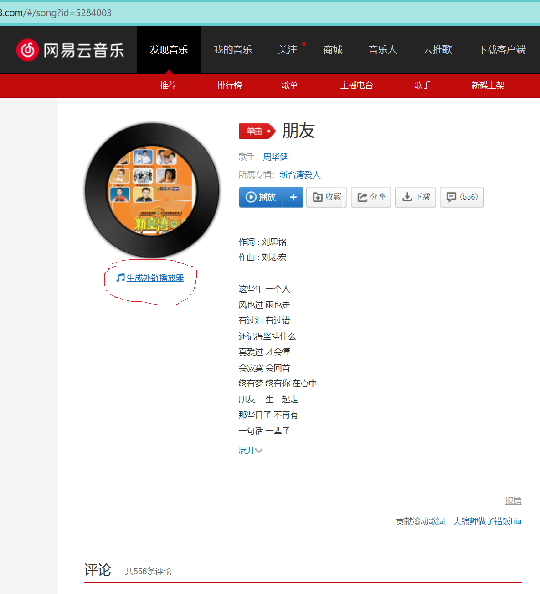
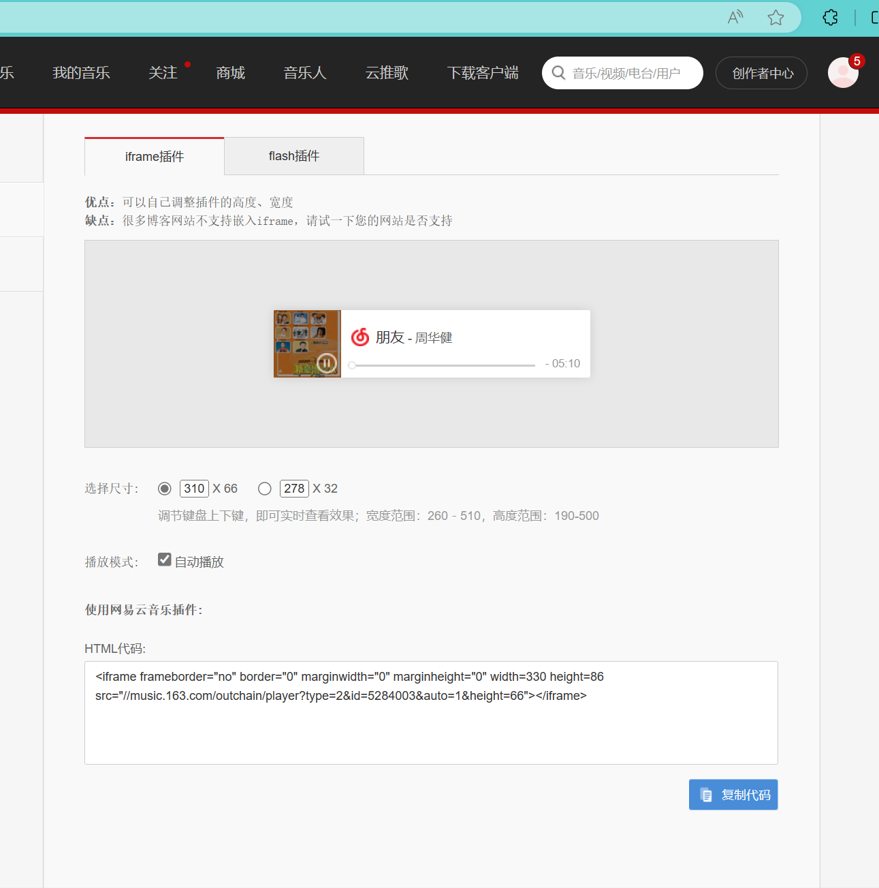
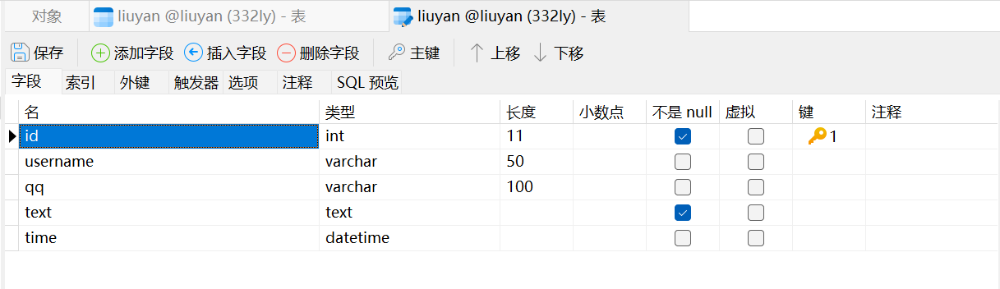

# 目录

[TOC]  

## 简介

Bootstrap框架,致力于我们332宿舍的网页开发，设计，留念。锻炼自我工程实践能力。  
未来将搭建阿里云服务器,申请域名,面向公众。

## 效果一览


  
  

轮播图 动态渐变字符...效果

## 开发工具

HBuilder X(代码编辑) phpstudy(Web服务器搭建) Navicat Premium 16(mysql数据库) phpstorm(php连接mysql)。  

## 图片

图片在目录：/img下 bg-img存的是展示图片  
core-img 图标 vidoes 视频mp4

```HTML
<div class="single-portfolio-content">
    <div class="hover-content"><a href="img/bg-img/2.jpg" class="portfolio-img">+</a></div>
</div>
```

图片可鼠标点击加号(+),放大轮播。

可将图片存入相应目录文件夹中,修改代码替换或者将图片重命名替换文件夹中的相应图片。  

## 视频

视频要准备一个封面图片和mp4视频,存入相应目录文件夹,修改相应路径。

```HTML
<div class="col-12 col-sm-6 col-lg-3 single_gallery_item video mb-30 wow fadeInUp" data-wow-delay="700ms">
    <div class="single-portfolio-content">
        <div class="hover-content"><a href="img/vidoes/2211.mp4" class="video-play-btn"><i class="arrow_triangle-right"></i></a></div>
    </div>
</div>
```

也可放大轮播,还可画中画模式。  

data-wow-delay="700ms"  参数是当网页刷新是延迟显示,将不同图像和视频设置不同延迟,形成美妙的效果。

## 网易云外链播放器

     
复制代码即可使用  
  
## 其他

网页中藏有三个b站or抖音链接。  
留言板功能(php连接mysql)

```HTML
 <li class="active"><a href="lxx.php">留言板</a></li>
```

但需要建立mysql(数据库 表单),可借助phpstudy创建mysql,用Navicat连接创建相应内容。  
mysql建立  

在 conn.php文件中可修改(地址,用户名,密码,数据库名):

```php
<!-- 这个php代码也能换成这样
    // 连接数据库(地址,用户名,密码,数据库名)
    $conn = new mysqli("localhost","root","root","liuyanban");
    // 判断
    if($conn->connect_error){
        die("连接失败");
    }
 -->
<?php
    // 连接数据库(地址,用户名,密码,数据库名)
    $servername="localhost";
    $username="liuyan";
    $password="123456";
    $dbname="liuyan";
    // 创建链接
    $conn = new mysqli($servername,$username,$password,$dbname);
    // 检测链接
    if($conn->connect_error){
        die("连接失败：".$conn->connect_error);
    }
?>
```

## 网页制作参考链接

[Ifrox/alime](https://github.com/lfrox/alime)  
[留言板制作参考](https://www.bilibili.com/video/BV1By4y1r7s1/?spm_id_from=333.337.search-card.all.click)  

## 我的开源

平台github  
链接:https://github.com/xfk215/332sushe  
无梯子访问网页慢。  

更多内容探索! 期待下次相遇!
